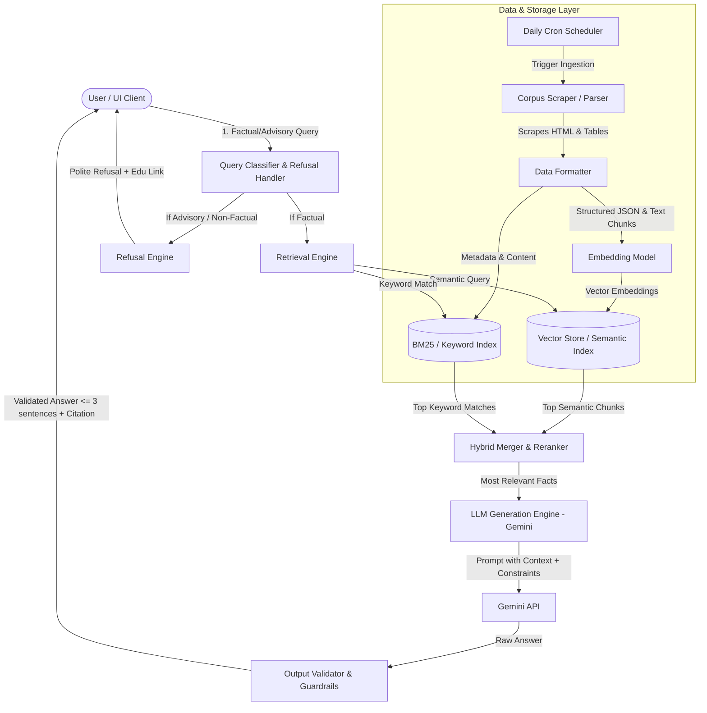

# Architecture Overview: Mutual Fund FAQ Assistant (Facts-Only Q&A)

This document details the architecture of the lightweight RAG (Retrieval-Augmented Generation) system built to answer factual queries about Motilal Oswal mutual fund schemes.

---

## 1. System Architecture Diagram

The system follows a classic **RAG (Retrieval-Augmented Generation)** architecture with specialized query analysis (advisory detection), data cleaning, and output guardrails to ensure compliance.



---

## 2. Component Design & Pipeline

### A. Data Ingestion & Storage Layer
To ensure maximum accuracy, the ingestion pipeline formats unstructured HTML pages into structured records.

1. **Daily Scheduler**:
   - A cron-based background service (e.g., GitHub Actions, AWS EventBridge, or a Celery Beat task) that triggers the ingestion pipeline once daily to fetch the latest NAV, expense ratios, and fund manager profiles.
2. **Scraper / Crawler**:
   - Fetches content from the 7 Motilal Oswal scheme pages and the AMC management page.
   - Cleans the raw HTML, discarding boilerplate elements (header, footer, navigation).
3. **Metadata Extraction**:
   - Parses key financial metrics (Expense Ratio, Exit Load, Minimum SIP, Benchmark, Riskometer, Fund Managers) directly into a structured metadata format.
4. **Chunking Strategy**:
   - **Structured Chunks**: Key details (e.g., Expense Ratio, Fund Managers) are stored as explicit metadata key-value pairs to avoid LLM hallucination.
   - **Text Chunks**: Paragraphs are chunked semantically (e.g., fund objectives, exit load terms) with parent-child relationships preserved.
5. **Hybrid Indexing**:
   - Chunks are embedded using an embedding model and indexed in a vector store.
   - A keyword index (BM25) is maintained in parallel. Factual queries (like "exit load of momentum fund") perform significantly better with keyword matching on terms.

### B. Query Processing & Refusal Layer
Before fetching context, the query is analyzed to determine if it complies with the "facts-only" policy.

* **Query Classifier**:
  - Employs a zero-shot classifier or system prompt to detect if a query is seeking investment advice (e.g., *"should I invest"*, *"which fund is better"*, *"predict returns"*).
* **Refusal Engine**:
  - If flagged as advisory, retrieval is bypassed completely.
  - Generates a friendly, standard refusal message, emphasizing the facts-only nature of the assistant.
  - Appends an official educational link (e.g., to AMFI or SEBI Investor Education sites).

### C. Retrieval Engine
* **Hybrid Search**:
  - Combines vector similarity results with keyword search scores to produce a merged list of relevant text chunks.
* **Metadata Filtering**:
  - Extracts the mentioned fund name from the query (if present) to filter retrieval chunks specifically to that scheme, preventing cross-fund contamination in answers.

### D. Generation & LLM Layer (Gemini)
The retrieved context and original query are fed into Gemini with a highly constrained system prompt.

* **System Prompt Constraints**:
  - Respond *only* using facts directly stated in the retrieved context.
  - Limit the response length to **maximum 3 sentences**.
  - Provide exactly **one** citation link.
  - Strictly forbid opinions, advice, or future speculations.
* **Example Prompt Template**:
  ```text
  You are a facts-only Mutual Fund FAQ Assistant. Your job is to answer queries strictly using the context provided below.
  
  Context:
  ---
  {retrieved_context}
  ---
  
  Instructions:
  1. Answer the query: "{user_query}"
  2. Use ONLY facts from the context. Do not extrapolate, assume, or provide investment advice.
  3. Keep the response to 3 sentences or fewer.
  4. Include exactly one markdown hyperlink pointing to the source URL (e.g., [Source Name](URL)).
  5. Refuse to answer if the query asks for advice or if the context does not contain the answer.
  ```

### E. Output Validation & Guardrails
A post-processing filter ensures the LLM's response adheres to constraints:
* **Length Check**: Validates that the output is $\le 3$ sentences. If exceeded, a fallback summarized answer is used or truncated.
* **Citation Validator**: Confirms that exactly one citation link exists and that the link belongs to the allowed domain (`groww.in`).
* **Compliance Checks**: Regex/keyword checks to ensure terms like "recommend", "should", "suggest", "better" are absent from factual responses.
* **Footer Injection**: Automatically appends the static metadata footer:
  `Last updated from sources: <date>`

---

## 3. Minimalist User Interface (UI)

The UI is designed to be simple, clean, and transparent, adhering to Groww-like aesthetics (green/blue tones, sleek typography, clean lines).

* **Header**:
  - App Logo & Name: **Mutual Fund FAQ Assistant**
  - Subtitle: *Facts-Only Q&A for Motilal Oswal Schemes*
* **Disclaimer Banner (Static & Prominent)**:
  - `⚠️ Disclaimer: Facts-only. No investment advice or recommendations provided.`
* **Example Questions Grid**:
  - Users can click one of three predefined questions to test the bot:
    1. *"What is the expense ratio of the Motilal Oswal Large and Midcap Fund?"*
    2. *"Who are the fund managers of Motilal Oswal Digital India Fund?"*
    3. *"Should I invest in the Motilal Oswal Contra Fund?"* (Demonstrates refusal handling)
* **Chat Window**:
  - Displays user and assistant messages sequentially.
  - Responses clearly highlight the citation link and footer date.

---

## 4. Privacy & Compliance Controls

* **Zero PII Storage**: The server does not log or persist any user inputs containing patterns matching PAN cards, Aadhaar numbers, phone numbers, or email addresses.
* **No Cache of Session Documents**: Financial statement queries (e.g., "how to download statements") output general process instructions with official links rather than attempting to fetch personal documents.
