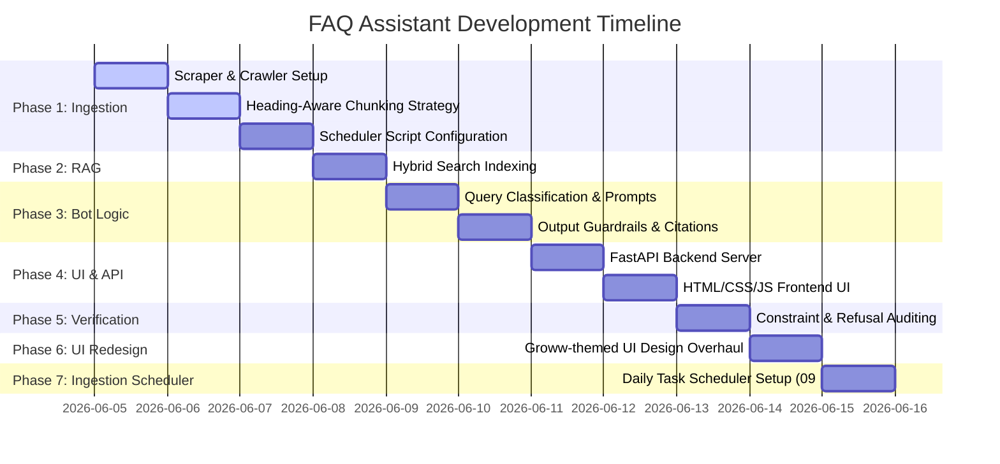

# Implementation Plan: Mutual Fund FAQ Assistant (Facts-Only Q&A)

This document outlines the phase-wise plan to design, implement, and verify the facts-only FAQ assistant for Motilal Oswal mutual fund schemes.

---

## Goal Description
Build a lightweight, compliant RAG (Retrieval-Augmented Generation) assistant using a curated corpus of 7 Groww fund pages and 1 AMC fund management page. The assistant will answer factual queries (expense ratio, managers, exit load, etc.), refuse advisory queries (should I invest, which fund is better), format responses strictly under constraints (max 3 sentences, 1 citation link, last updated date), and expose a clean, minimal user interface.

---

## User Review Required

> [!IMPORTANT]
> **Daily Ingestion Scheduler (Phase 7)**: Configures the scheduled task `GrowwFAQIngestion` to execute automatically every day at **9:45 AM IST** (09:45) using Windows Task Scheduler.
> 
> **API Keys & LLM Service**: The generation and classification engine relies on **Groq** (`llama-3.3-70b-versatile`). An API key (`GROQ_API_KEY`) must be configured. Optional: `GEMINI_API_KEY` for semantic embeddings, otherwise fallback to local TF-IDF is used.
> 
> **Ingestion Scraper**: Groww.in has basic bot protection. We use `requests` with custom headers and `BeautifulSoup` for scraping. If they block standard requests, we fallback to pre-cached mock HTML or static mock responses.

---

## Design Decisions & Resolutions

> [!NOTE]
> 1. **Framework Choice**: **FastAPI** was selected as the backend server framework for its performance, simplicity, and ease of serving static frontend files.
> 2. **Database Choice**: **Pure NumPy-based Vector Indexing** with a local JSON chunks file (`data/chunks.json`) was selected instead of ChromaDB or FAISS. This provides:
>    - **Zero installation/compilation risk**: Avoids C++ compile and DLL load errors (`c10.dll` or `onnxruntime_pybind11_state`) common on Windows machines.
>    - **High Performance**: Instantaneous search times (<1ms) for our small corpus of 155 chunks.
>    - **Simplified Filtering**: Easy pre-filtering using Python list comprehensions to prevent cross-fund matching errors.

---

## Proposed Changes

We will organize the code under the root folder `d:\new-project\`.

### Ingestion & Scheduling Component

#### [MODIFY] [cron_job.py](file:///d:/new-project/cron_job.py)
A lightweight runner script that executes `ingestion.py` and logs output. It will be updated with **working directory resolution guards** to prevent file path and import failures when executed from Windows Task Scheduler:
- Retrieve the absolute path of the directory containing `cron_job.py`.
- Change the current working directory to the project root (`os.chdir`).
- Add the root directory to Python's system path (`sys.path.append`) to ensure imports function properly.

#### [NEW] [ingestion.py](file:///d:/new-project/ingestion.py)
Python script responsible for downloading, parsing, and chunking the 7 Groww mutual fund URLs and the 1 AMC management URL. It will:
- Clean HTML text, parsing tabular metrics (NAV, Expense Ratio, exit loads) to plain text lines.
- Implement the **Heading-Aware Line-by-Line Chunking Strategy**:
  1. **Line integrity**: Split text on line boundaries (keeping table rows and list items whole).
  2. **Heading boundary splits**: Use major section headers (`h2:`, `h3:`) as hard split boundaries to keep topics separated.
  3. **Size constraint**: Accumulate lines up to 800 characters to group details together.
  4. **Metadata tagging**: Tag each chunk with its source URL, page title, last updated date, and a specific `fund_tag` (e.g., `contra`, `digital_india`, `amc`) for downstream query filtering.
- Save the list of parsed chunks directly into `data/chunks.json`.

#### [NEW] [setup_scheduler.ps1](file:///d:/new-project/setup_scheduler.ps1) (Phase 7)
PowerShell script to automate registration of the Windows Task Scheduler task:
- Detect the absolute path of the virtual environment python interpreter (`.venv\Scripts\python.exe`).
- Detect the absolute path of `cron_job.py`.
- Register a daily Task Scheduler task named `GrowwFAQIngestion` scheduled to run at `09:45` AM local time (IST).

---

### RAG & Chatbot Engine

#### [NEW] [rag_engine.py](file:///d:/new-project/rag_engine.py)
Builds the search logic. It will:
- Load the pre-computed chunks from `data/chunks.json`.
- Apply strict **Metadata Pre-filtering**: If the user query specifies a particular fund, the retrieval candidate pool is filtered to match that `fund_tag` (plus general `amc` chunks), preventing cross-fund matching errors.
- Perform **Hybrid Retrieval**: Combines local TF-IDF keyword matching (vital for exact stats, names, and numbers) and cloud-based **Gemini Semantic Embeddings** (`models/text-embedding-004`). If `GEMINI_API_KEY` is not present, it falls back gracefully to pure local TF-IDF (cos-sim) search.

#### [NEW] [chatbot.py](file:///d:/new-project/chatbot.py)
Core logic for:
1. **Query Classification**: Pre-checks if the query is seeking investment advice (e.g. "should I invest") using a prompt to Groq.
2. **LLM Prompting**: Queries **Groq (llama-3.3-70b-versatile)** with retrieved context, enforcing strict facts-only formatting.
3. **Guardrails**: Post-processes responses to validate sentence count (<= 3), verifies citation links, and appends the static updated date footer.

---

### API Backend Server

#### [NEW] [server.py](file:///d:/new-project/server.py)
Exposes FastAPI routes:
- `GET /api/status`: Returns the ingestion status, database records count, last updated date, and whether the API key is configured.
- `POST /api/chat`: Takes the user's message, runs `chatbot.py` logic, and returns the response.
- Exposes routes to serve the static frontend files (`/` for `index.html`, `/styles.css` for stylesheet, and `/app.js` for JS code) to run both backend and frontend on a single port.

---

### Frontend UI

#### [MODIFY] [index.html](file:///d:/new-project/index.html)
Redesigned multi-view Single Page Application (SPA) based on Groww Wealth Assistant layouts:
- Centered secure login card featuring mock input fields, Biometrics buttons, and secure notices.
- Sidebar navigation panel layout separating Chat, Schemes Explorer, and Compliance Profile views.

#### [MODIFY] [styles.css](file:///d:/new-project/styles.css)
CSS file using Outfit/Inter typography, fluid flexbox/grid layout systems, active state highlights, and transitions.

#### [MODIFY] [app.js](file:///d:/new-project/app.js)
Frontend logic to handle screen transitions, active view toggling, suggested chips clicks, and backend HTTP calls.

---

## Phase-wise Timeline

---

## Verification Plan

### Automated Tests
- Run `python test_bot.py` to verify all compliance and privacy checks (sentence counts, single citation, SEBI/AMFI referral cards, PII detection).

### Scheduler Verification (Phase 7)
- Execute `setup_scheduler.ps1` to register the scheduled task.
- Query the Task Scheduler registry:
  - Command: `schtasks /query /tn "GrowwFAQIngestion" /fo list`
  - Verify that the start time is listed as `09:45:00` and status is ready.
- Run task manually to verify:
  - Command: `schtasks /run /tn "GrowwFAQIngestion"`
  - Verify that `logs/ingestion.log` is generated correctly without path exceptions.

### Manual Verification
1. Launch the FastAPI server locally (`uvicorn server:app --reload`).
2. Open the webpage `index.html` in a browser.
3. Click on the suggested questions and verify factual compliance.
4. Verify PII masking in the "Compliance Profile" view.
